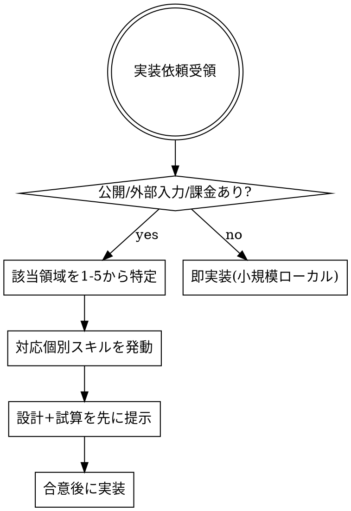

# Vibe Coding Overview — 6原則索引

## Overview

AI支援開発で致命傷を負わないための6領域の入口。各領域の詳細は個別スキルに分離している。実装着手前にこのスキルで該当領域を特定し、必要な個別スキルを追加で発動する。

**核心原則:** 「動くコード」より先に **漏れない・燃えない・違法でない・壊れない** を担保する。

## When to Use

- Webアプリ・API・クラウドリソースを生成/デプロイしようとするとき
- 外部公開・ユーザー入力受付・課金APIを含む機能の実装着手時
- 「とりあえず動けばいい」「プロトタイプだから」が出たとき(最も危険な瞬間)

**使わない場面:** ローカル限定・使い捨てスクリプト。

## 6 Guardrails Index

実装着手前に該当領域を判定し、対応スキルを追加で発動する。

| # | 領域 | 発動トリガ例 | 詳細スキル |
|---|---|---|---|
| 1 | Security | 外部公開/認証認可/アップロード/IAM | `security-guardrails` |
| 2 | Cost | 従量課金API/LLM/クラウドリソース | `cost-estimation` |
| 3 | Legal | スクレイピング/個人情報/依存ライブラリ | `legal-compliance-check` |
| 4 | Data Design | DBスキーマ/削除方針/金額日時の扱い | `durable-data-design` |
| 5 | Performance | ループ内クエリ/大量データ/長時間処理 | `performance-sizing` |
| 6 | Incident | 本番障害/データ破損/漏洩発生時 | `incident-response` |

## Pre-Implementation Workflow

## Red Flags — この言葉が出たら立ち止まる

| 発言 | 本当のリスク |
|---|---|
| 「とりあえず動けばいい」 | 6原則レビュー省略 → 本番昇格で被害 |
| 「プロトタイプだから」 | そのまま公開される典型 |
| 「後で直す」 | データ構造は直らない、漏洩は取り戻せない |

## The Bottom Line

致命的な失敗だけは避けながら、仮説→試す→壊す→学ぶ→直す を繰り返す。
**排除ではなく、ガードレールと共に挑戦する。**
